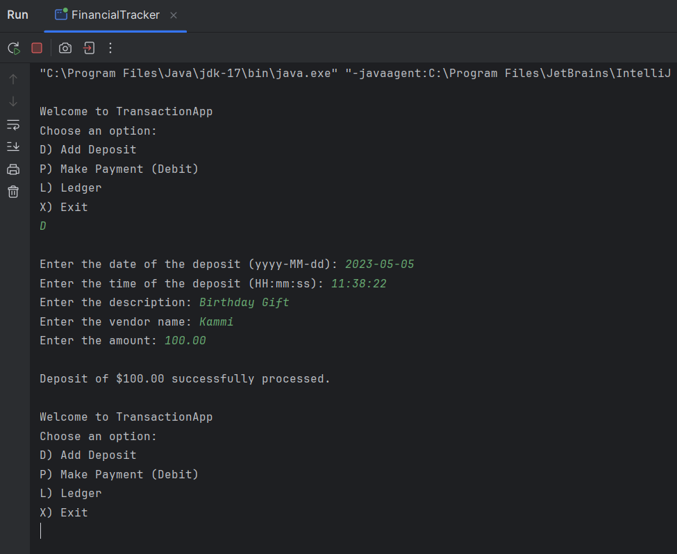
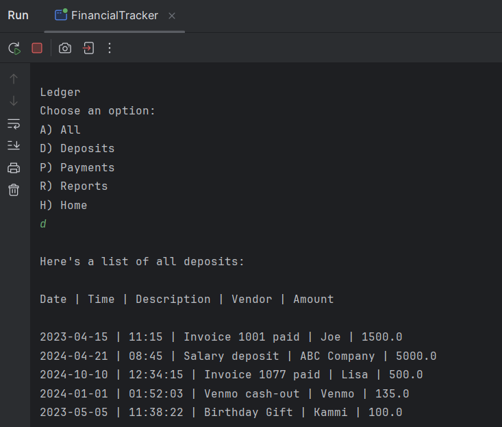

# Project Title

## Description of the Project

The **Financial Tracker** application allows users to report deposits (positive) and payments (negative) to a ledger of transactions, stored as a .CSV file.
Users are also able to view reports on those transactions. Every entry added by users is stored to the file, creating a cumulative list.

### Funcionality:
- **Add Deposits**: A function wherein users enter details of a transaction (date, time, description, vendor, amount) to the deposits list.
- **Add Payments**: A similar function that asks for the same information, but is logged in the ledger as a negative amount, as it is a payment.
- **Ledger**: A submenu where users can view the ledger as a full list of all transactions, or can filter to only see deposits or payments.
- **Reports**: Another submenu where users can generate reports filtered by different criteria:
    - Month-To-Date
    - Previous Month
    - Year-To-Date
    - Previous Year
    - Filter by specific vendor name
- **transactions.csv**: This file is where all the information is stored, and each entry put in by users is added to the list.

## User Stories

The user stories I used to aid in the development are as follows:

- As a Customer, I want to have a navigable Home Screen so that I can have a good user experience.
- As a Customer, I want to make Deposits and Payments, so that I can log the entries into a ledger.
- As a Customer, I want to see a Ledger menu/screen, so that I can see neatly compiled data of transactions.
- As a Customer, I want a navigable Reports menu, so that I can see the filtered data of transactions.

## Setup

Instructions on how to set up and run the project using IntelliJ IDEA.

### Prerequisites

- IntelliJ IDEA: Ensure you have IntelliJ IDEA installed, which you can download from [here](https://www.jetbrains.com/idea/download/).
- Java SDK: Make sure Java SDK is installed and configured in IntelliJ.

### Running the Application in IntelliJ

Follow these steps to get your application running within IntelliJ IDEA:

1. Open IntelliJ IDEA.
2. Select "Open" and navigate to the directory where you cloned or downloaded the project.
3. After the project opens, wait for IntelliJ to index the files and set up the project.
4. Find the main class with the `public static void main(String[] args)` method.
5. Right-click on the file and select 'Run 'FinancialTracker.main()'' to start the application.

## Technologies Used

- Java: JDK 17.
- Any additional libraries or frameworks used in the project.

## Demo

Here's a few screenshots to demonstrate various aspects of the application:

**Adding A Deposit**

**Adding A Payment (and handling an input error)**

**Load All Transactions**

**Show Just Deposits**

**Show Just Payments**

**Filtering By Date**

**Filtering By Vendor Name**

## Future Work

Potential additions that could be implemented into this application:

- Making this into an application window so that navigation isn't done exclusively within IntelliJ.
- Condensing the code, as it is rather bulky in some places.
- Adding a calculator that compiles the totals of deposits/payments.

## Resources

To help in building this code, I referenced Stack Overflow to see how others have solved similar problems.

## Thanks

- Thank you to **Raymond** for helping me out when I genuinely struggled with the code logic, and for overall guidance.
- **Carmen & Corrie** helped me out a good bit, and their collaboration was vital in me getting this code done without tearing my hair out.